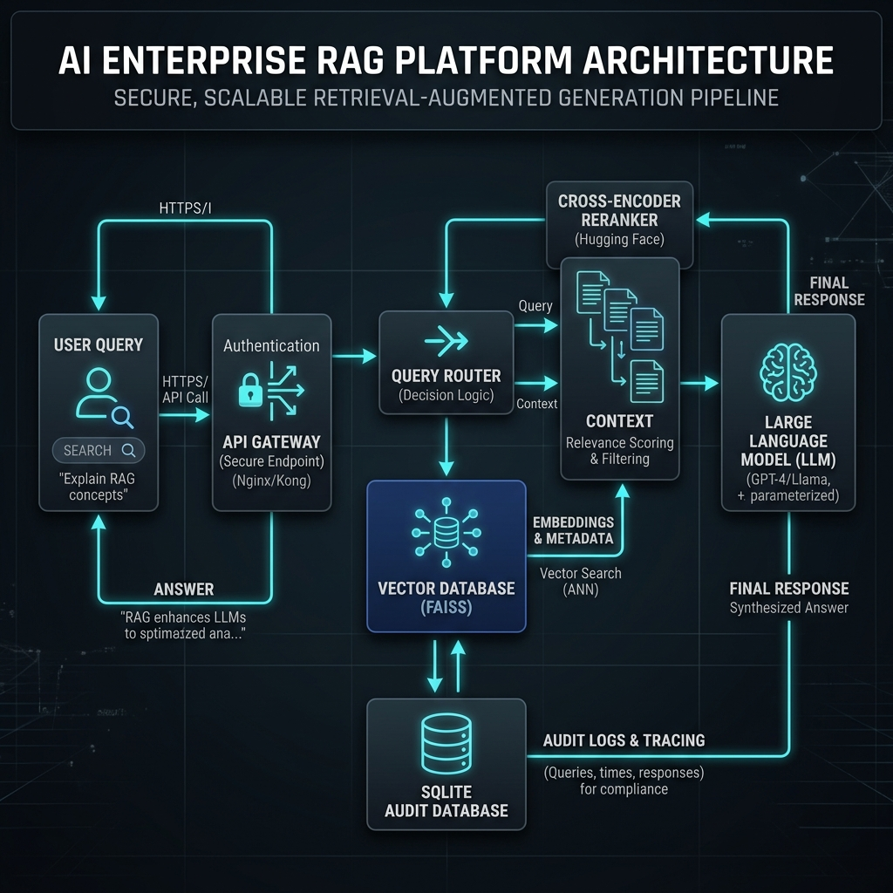
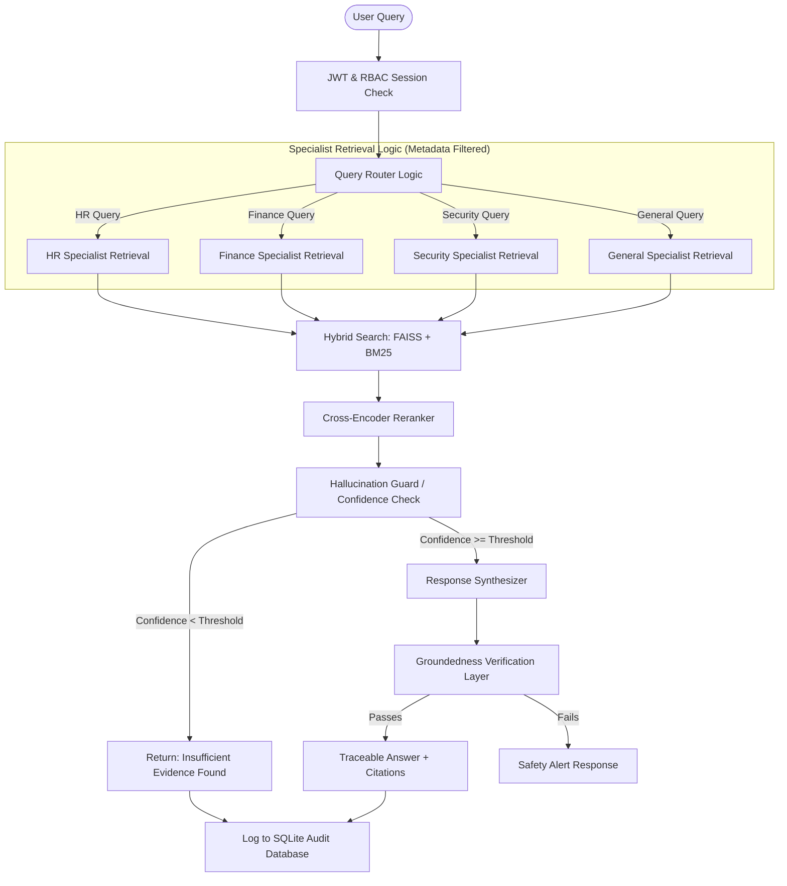

# Secure Enterprise Knowledge Assistant

An AI-powered enterprise knowledge retrieval platform that enables secure querying across PDFs, CSVs, JSON logs, and structured enterprise datasets using Retrieval-Augmented Generation (RAG).

## Features

- Multi-source ingestion
- Hybrid Retrieval (FAISS + BM25)
- Cross-Encoder Re-ranking
- Role-Based Access Control (RBAC)
- Query Routing
- Explainable Citations
- Confidence Scoring
- Audit Logging
- Streamlit Dashboard

## Tech Stack

- Python
- FastAPI
- Streamlit
- FAISS
- BM25
- Sentence Transformers
- Cross-Encoder Re-ranker
- SQLite
- Pandas
- PyPDF
- Docker


A technically strong, practical, and understandable Secure Enterprise Knowledge Assistant with strict Role-Based Access Control (RBAC) and a lightweight agent-inspired workflow where a router directs queries to domain-specific retrieval logic. Designed as an AIML Capstone project.

> **Project Explanation Statement:**
> Developed a Secure Enterprise Knowledge Assistant supporting multi-source enterprise data ingestion (PDF, CSV, JSON, SQL), Hybrid Retrieval (FAISS + BM25), Role-Based Access Control, Query Routing, explainable Citations, Confidence Scoring, audit logging, and hallucination mitigation. The system enforces RBAC before retrieval, ensuring restricted content never enters the generation context. The RAG Pipeline provides secure, grounded, and traceable responses suitable for enterprise environments.

---

## 🎨 System Design & Architecture



The system coordinates security and intelligence across a lightweight agent-inspired workflow where a router directs queries to domain-specific retrieval logic, using Hybrid Retrieval and a Cross-Encoder Reranker:



---

## 💡 Design Choices & Trade-offs

1. **Consolidated Backend (`main.py`)**:
   - **Choice**: All backend logic (FastAPI endpoints, SQLite DB helper, parser chunkers, FAISS search, and routing workflow) is written inside `main.py`.
   - **Trade-off**: This violates standard enterprise modularity (where each component is a separate service or package), but it keeps the project cohesive, prevents circular import issues with machine learning models, and makes local deployment and debugging extremely simple.
   - **Interview Explanation**: "Consolidating the backend allowed us to keep the deployment footprint small and avoid the overhead of microservice communication during development, though in a real-world enterprise setting, we would split these into a dedicated Ingestion Service, Auth Server, and Vector Search Service."

2. **Pre-Retrieval Metadata Filtering**:
   - **Choice**: Security clearance is checked *before* executing the search. A SQL query resolves authorized document IDs, which are passed as a metadata filter lambda directly into the FAISS index search.
   - **Trade-off**: Ensures unauthorized document chunks never leak into the retrieval context. However, pulling all allowed document IDs first scales linearly with the document count.
   - **Interview Explanation**: "By applying the filter during the index search rather than post-filtering, we guarantee restricted context never enters the LLM generation prompt. For scaling to millions of files, we would swap FAISS for a managed vector database (like Qdrant or Milvus) that natively handles hierarchical role partition indexes."

3. **Local CPU Inference for RAG**:
   - **Choice**: Runs `sentence-transformers` embeddings (`all-MiniLM-L6-v2`) and Cross-Encoder re-ranker (`ms-marco-MiniLM-L-6-v2`) locally on the CPU, with a fallback Mock LLM.
   - **Trade-off**: Free, completely offline, and keyless setup, but introduces a 1-2 second latency per query.
   - **Interview Explanation**: "Using local sentence-transformers models makes the system self-contained and free. In a production pipeline, we would host these models on a GPU-accelerated server like Triton Inference Server or vLLM to achieve sub-100ms latency."

---

## 🚧 Challenges Faced & Resolved

1. **Tabular Data & Log Ingestion**:
   - *Problem*: Passing raw CSV files or JSON log dumps to a vector database resulted in poor semantic retrieval because the vector model didn't understand row relationships.
   - *Resolution*: We developed parser pre-processors that convert structured data rows into descriptive English sentences (e.g. converting a CSV row into: `Row 3 in sales_records.csv: TransactionID: TX1003, Client: Apex, Amount: 150000`) before vectorizing.
2. **FAISS Lambda Filtering**:
   - *Problem*: Standard FAISS does not support flexible SQL-like metadata queries easily.
   - *Resolution*: We implemented a metadata filter callable that intercepts FAISS node evaluations: `filter=lambda metadata: metadata.get("document_id") in allowed_ids`.

---

## ⚠️ Known Limitations

- **Keyword-Assisted Routing**: Query routing is keyword-assisted and can be improved using LLM-based intent classification.
- **FAISS Scaling**: FAISS metadata filtering works well for small datasets but would require a more scalable document permission architecture for enterprise-scale deployments.
- **CPU Inference Latency**: Local embedding and re-ranking models increase latency compared to dedicated GPU-hosted inference services.
- **Synthetic Datasets**: The current system runs on synthetic data generated for demonstration purposes.
- **Quantitative/Aggregation Queries**: Standard RAG retrieves individual text passages and cannot perform database-level math. Questions like *"How many documents are there?"* or *"How many employees are present?"* will be caught by the Groundedness Guard and safely return *"Insufficient evidence found"* to prevent hallucination.


---

## ⚙️ Future Enhancements (TODOs)

- [ ] **Hierarchical Chunking**: Replace the sliding character window with an AST or markdown-header-aware parser to improve chunk coherence.
- [ ] **GPU Acceleration**: Add support for CUDA GPU detection to accelerate embeddings and re-ranking.
- [ ] **OAuth2/Okta Integration**: Replace the SQLite user account table with Okta/Auth0 or Active Directory LDAP for corporate SSO.
- [ ] **Multi-turn Chat Memory**: Add thread memory using a sliding window context or summary buffer.

---

## 🛠️ Local Installation & Run Guide

### Option A: Standard Local Run
#### Step 1: Install Dependencies
```bash
pip install -r requirements.txt
```

#### Step 2: Seed & Boot the Backend
The backend automatically seeds the database on first boot. If you want to run the seeder manually:
```bash
python generate_dataset.py
```
Then start the API backend server:
```bash
python main.py
```
* **API Base URL**: `http://localhost:8000`
* **Interactive API Docs (Swagger UI)**: `http://localhost:8000/docs`

#### Step 3: Start the Streamlit Dashboard
To run the Streamlit frontend client (run as a Python module to prevent launcher path conflicts on Windows):
```bash
python -m streamlit run app.py
```
* **Streamlit Dashboard**: `http://localhost:8501`

#### Step 4: Run Tests
To run the automated test suite:
```bash
python -m pytest tests/test_platform.py -v
```

---

### Option B: Containerized Run (Via Docker)
If you have **Docker Desktop** installed and running on your system, you can boot the entire platform (FastAPI + Streamlit + Seeding script) in a containerized environment with a single command:

```bash
docker-compose up --build
```
* **Streamlit Dashboard**: `http://localhost:8501`
* **Interactive API Docs**: `http://localhost:8000/docs`
* *Note: The local `./data` folder is mounted as a persistent volume to preserve audit logs and uploaded documents even when the containers are stopped.*

---

## 💡 Recommended Test Queries
To guide your evaluation of the RAG retrieval, security permissions, and guardrails, try these test queries in the **Chat Assistant**:

### 1. Authorized Informational Queries (RAG & Citations)
* **General Query**: `"What are the Python coding guidelines?"` (Retrieves public engineering file).
* **HR Query**: `"What is the leave policy?"` (Retrieves internal HR handbook).
* **Confidential Query** *(Log in as Admin or HR)*: `"What is the salary range for Level 3?"` (Retrieves confidential HR compensation plan).

### 2. Security Clearance Enforcement (Access Denied)
* **Blocked Department Context**: Log in as `alice` (HR Specialist) and ask: `"What is the operating expense for research in Q2?"` (Since Alice does not have Finance department clearance, access is blocked).
* **Blocked Intent Routing**: Log in as `bob` (Finance) or `alice` (HR) and ask: `"What did David do on 2026-06-05?"` (Queries involving security audit logs are strictly restricted to Admin/Compliance).

### 3. Hallucination Guardrails (Safely Blocked)
* **Out-of-Scope Query**: `"Who is the CEO of the company?"` (Expected: Intercepted by the Groundedness Check -> *"Insufficient evidence found"*).
* **Quantitative Aggregation Query**: `"How many total documents are present?"` (Expected: Standard RAG cannot perform DB counting, so the system rejects it as *"Insufficient evidence found"* rather than hallucinating a guess).

---

## 🎨 Additional UI Enhancements

- **Web Audio API Sound Engine**: UI sound effects are dynamically synthesized in the browser using the JavaScript Web Audio API. This ensures audio feedback plays reliably without breaking due to static file path resolution issues in web containers, while keeping the deployment footprint minimal.

---

## 👥 Demo Profiles
Use the **Quick Demo Profiles** tab on the login screen to quickly switch clearances:

| Username | Password | Role | Department | Clearance Scope |
|---|---|---|---|---|
| **admin** | `admin123` | **Admin** | General | Access to ALL documents, user lists, metrics, and logs. |
| **alice** | `alice123` | **HR** | HR | HR handbooks, employee directories, public files. |
| **bob** | `bob123` | **Finance** | Finance | Sales records, revenue reports. |
| **charlie** | `charlie123` | **Engineering** | Engineering | Coding guidelines, repository architectures. |
| **david** | `david123` | **Compliance** | Security | Compliance reports, security audit logs, performance traces. |
